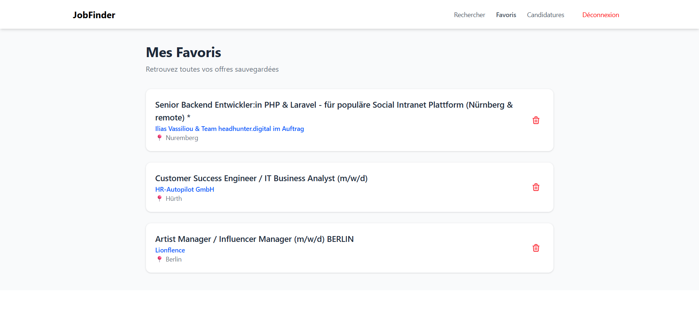
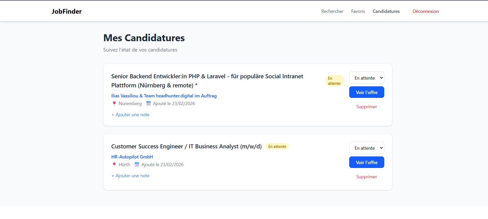

# JobFinder 🔍

Application Angular de recherche d'emplois utilisant des APIs publiques internationales.

## 📸 Screenshots

### 🔎 Search Page
Search for jobs by keywords and location with paginated results.


### ⭐ Favorites Page
Save and manage your favorite job offers.



### 📝 Applications Page
Track your job applications with status management and notes.



---
## Fonctionnalités

- **Recherche d'emplois** — Recherchez des offres via l'API Arbeitnow avec filtres par mots-clés et localisation
- **Gestion des favoris** — Sauvegardez vos offres préférées (gérée avec NgRx)
- **Suivi des candidatures** — Suivez l'état de vos candidatures (En attente / Accepté / Refusé)
- **Authentification** — Inscription, connexion, gestion du profil avec stockage localStorage
- **Design responsive** — Interface adaptative avec Tailwind CSS

## Technologies

| Technologie | Utilisation |
|---|---|
| Angular 21 | Framework frontend (standalone components) |
| NgRx | State management (favoris) |
| RxJS | Programmation réactive |
| Tailwind CSS | Styling & responsive design |
| JSON Server | API REST simulée (persistance des données) |
| Reactive Forms | Formulaires avec validation |
| Arbeitnow API | API publique de recherche d'emplois |

## Concepts Angular utilisés

- ✅ Standalone components
- ✅ Lazy Loading (routes feature modules)
- ✅ Guards (AuthGuard pour routes protégées)
- ✅ Intercepteurs HTTP (gestion centralisée des erreurs)
- ✅ Services & Injection de dépendances
- ✅ Reactive Forms avec validation
- ✅ Pipes personnalisés (TruncatePipe)
- ✅ Composition de composants (parent/child — min. 2 par page)
- ✅ Data binding (property binding, event binding, two-way binding)
- ✅ NgRx Store, Effects, Selectors, Actions
- ✅ RxJS Observables

## Architecture

```
src/app/
├── core/                    # Services, modèles, guards, intercepteurs
│   ├── guards/              # AuthGuard
│   ├── interceptors/        # Error interceptor
│   ├── models/              # User, Job, Favorite, Application
│   └── services/            # Auth, Job, Favorites, Applications
├── features/                # Modules fonctionnels (lazy loaded)
│   ├── auth/                # Login, Register, Profile
│   ├── jobs/                # Recherche d'emplois
│   ├── favorites/           # Gestion des favoris
│   └── applications/        # Suivi des candidatures
├── shared/                  # Composants partagés
│   └── pipes/               # TruncatePipe
└── store/                   # NgRx state management
    └── favorites/           # Actions, Reducer, Effects, Selectors
```

## Installation & Lancement

### Prérequis
- Node.js 18+
- npm

### Installation
```bash
npm install
```

### Démarrage

1. **Lancer JSON Server** (terminal 1) :
```bash
npm run server
```
Le serveur JSON démarre sur `http://localhost:3000`

2. **Lancer Angular** (terminal 2) :
```bash
npm start
```
L'application est accessible sur `http://localhost:4200`

## API utilisée

**Arbeitnow API** — API publique gratuite sans authentification requise
- Base URL : `https://www.arbeitnow.com/api/job-board-api`
- Couverture : Europe + Remote
- Documentation : https://www.arbeitnow.com/blog/job-board-api

## Données persistées

| Stockage | Données |
|---|---|
| localStorage | Profil utilisateur (authentification) |
| JSON Server (db.json) | Utilisateurs, Favoris, Candidatures |

## Choix techniques justifiés

- **localStorage** plutôt que sessionStorage : permet une session persistante même après fermeture du navigateur, meilleure UX pour les utilisateurs
- **NgRx pour les favoris** : gestion d'état centralisée avec Redux DevTools pour le debugging
- **Arbeitnow API** : pas d'authentification requise, idéale pour le développement rapide
- **Standalone components** : approche moderne Angular, meilleur tree-shaking
- **Lazy Loading** : chargement optimisé des modules à la demande
